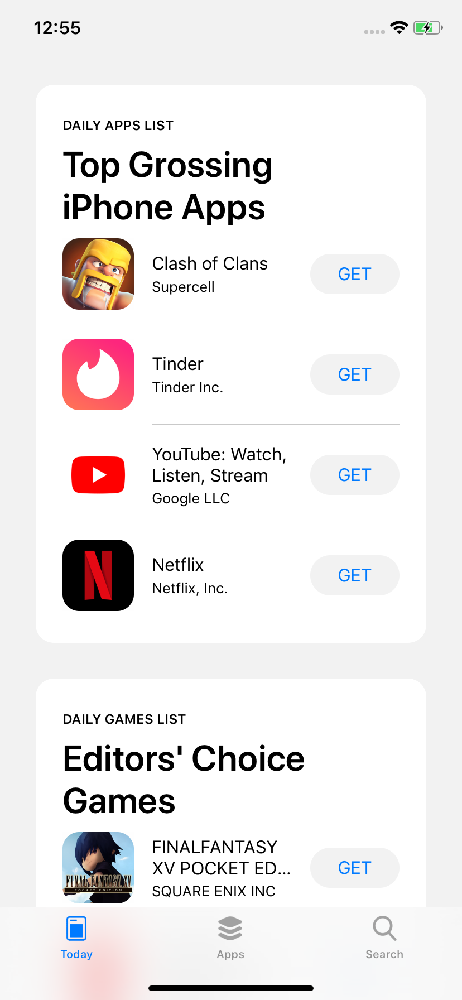
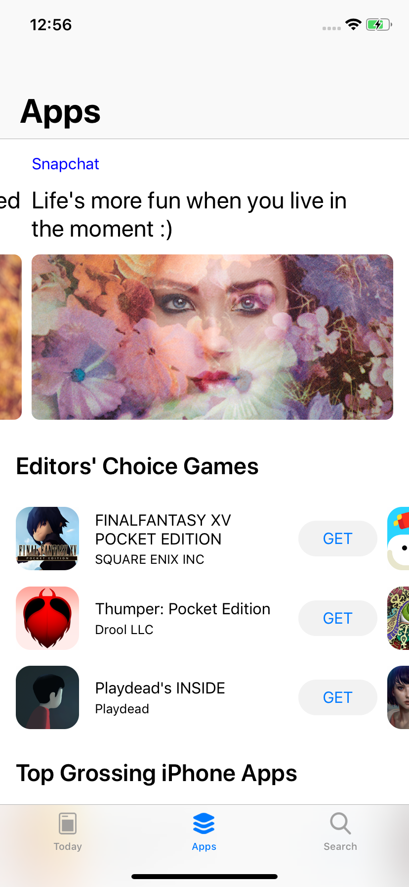
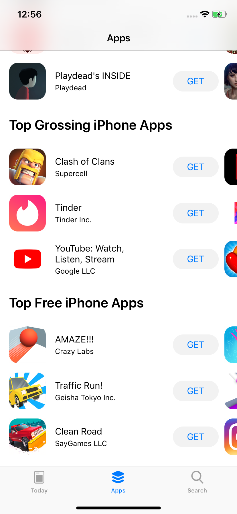
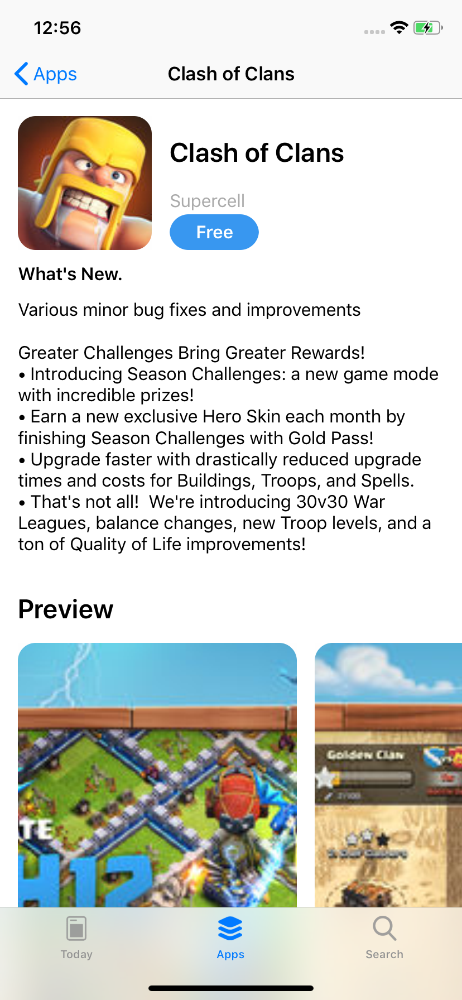
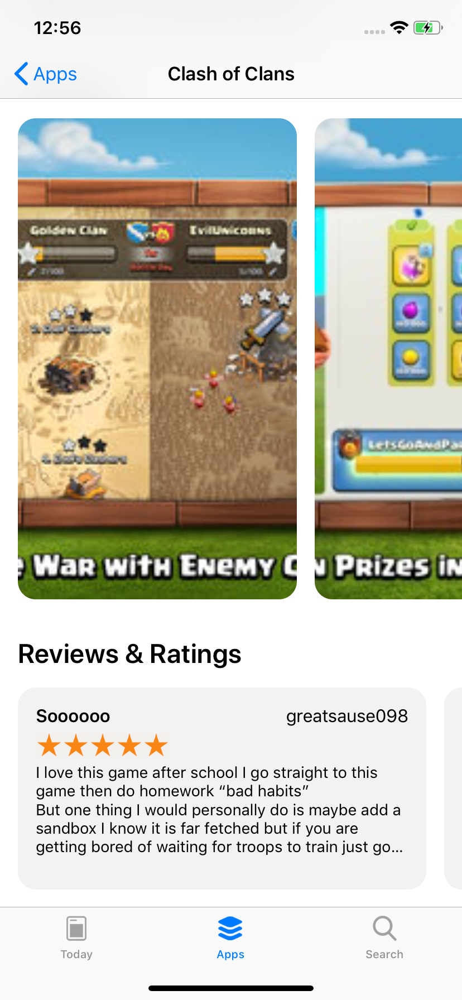

# AppStore-Clone
This is just an AppStore Clone App. it fetches all the data from iTune Api (https://rss.itunes.apple.com/en-us) . 

## Today Page

## Home Page

## App Detail Page

## Search  Page

#### what I Learned 
   - Build Complex UI Programatically 
   - DispatchGroup to Synchronise Multiple Async Tasks 
   - Animation 
   - and much more...
